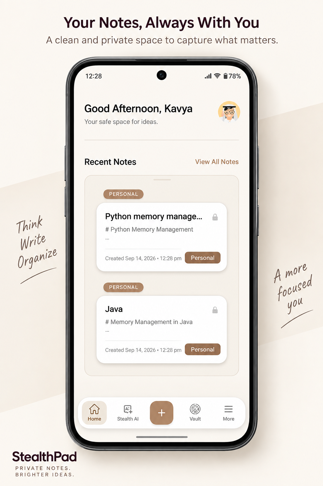
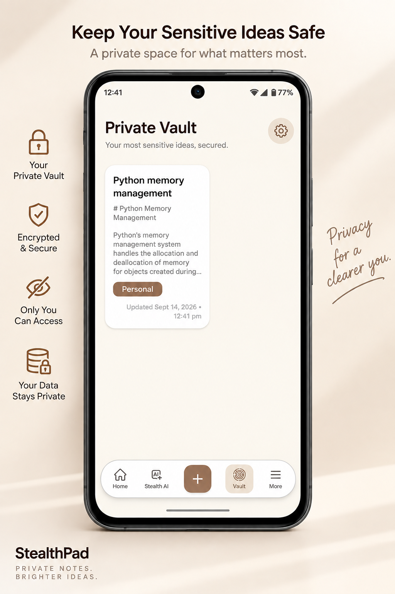
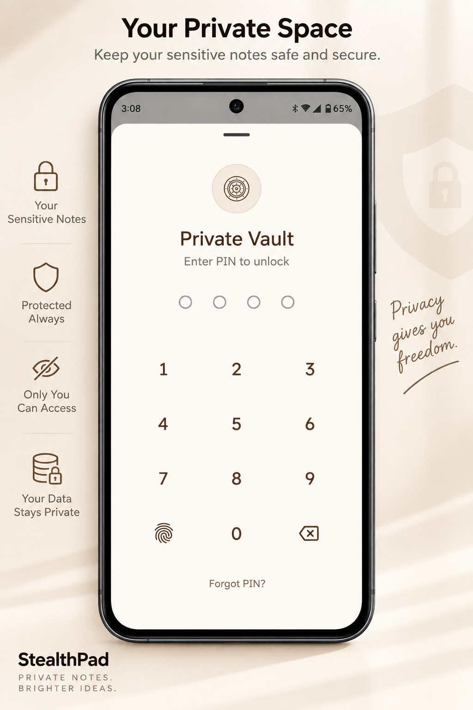
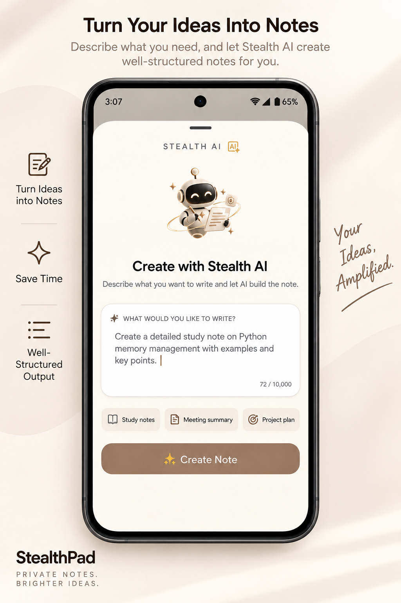
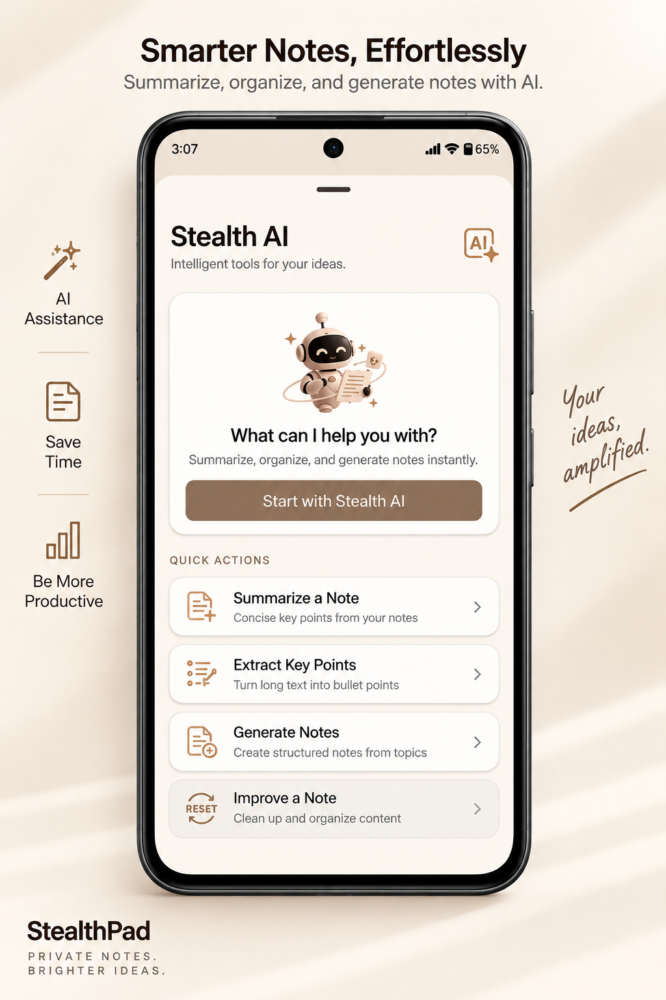
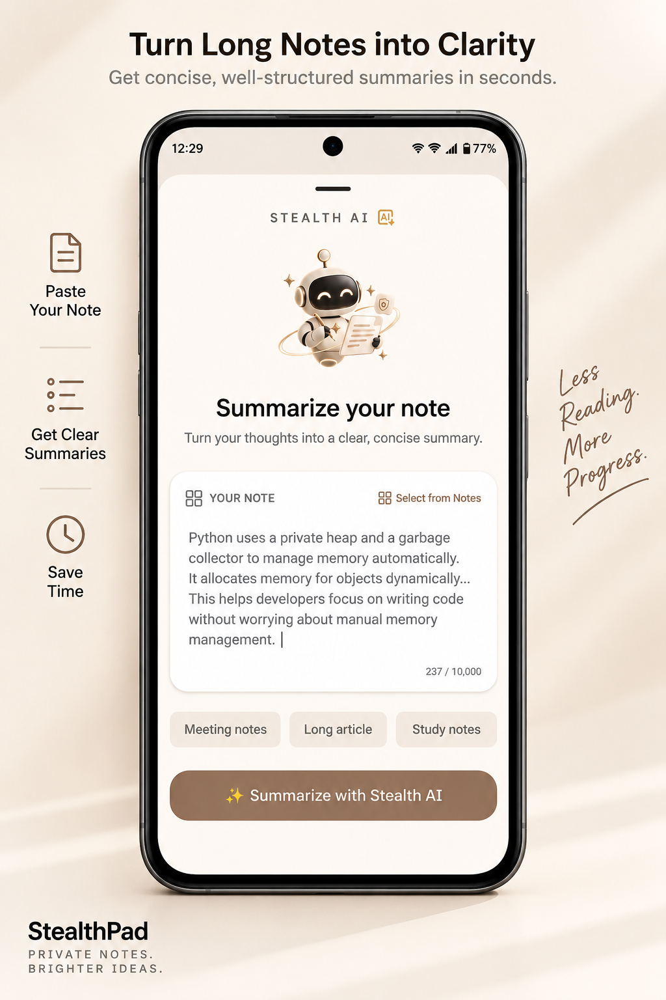
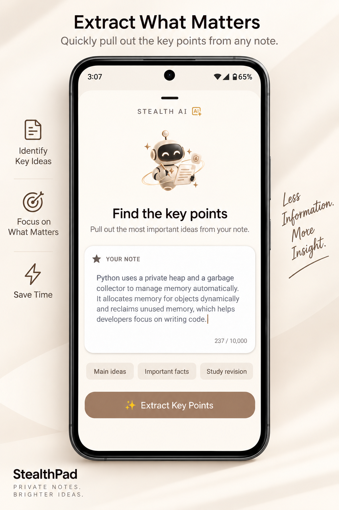
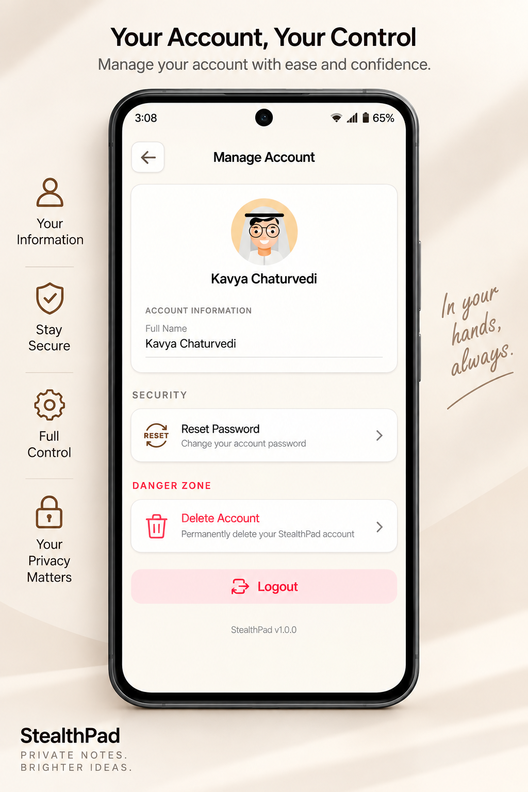

# StealthPad

StealthPad is a privacy-focused Android note-taking application designed for secure personal information management. It combines local-first storage, device-backed encryption, a protected vault, account-based synchronization, and AI-assisted note tools.

The repository contains the Android client, a Spring Boot backend, and a small static documentation site.

## Contents

- [Product Overview](#product-overview)
- [Core Features](#core-features)
- [Repository Structure](#repository-structure)
- [Architecture](#architecture)
- [Technology Stack](#technology-stack)
- [Screenshots](#screenshots)
- [App Video](#app-video)
- [Prerequisites](#prerequisites)
- [Getting Started](#getting-started)
- [Android Application](#android-application)
- [Backend Service](#backend-service)
- [Documentation Site](#documentation-site)
- [Security and Privacy](#security-and-privacy)
- [Development](#development)
- [Roadmap](#roadmap)
- [License](#license)

## Product Overview

StealthPad is built around a local-first model:

1. Notes are created and used locally on the Android device.
2. Note data is encrypted before being written to local storage.
3. The Android application can continue working when the device is offline.
4. When connectivity is available, authenticated synchronization transfers note changes to the backend.
5. AI operations are available when explicitly requested by the user and require communication with the backend and configured AI provider.

The application supports ordinary notes as well as a private vault for more sensitive content.

## Core Features

### Secure local notes

- Room is used for local persistence.
- Note content is encrypted with AES/GCM before local storage.
- Encryption keys are generated and protected through the Android Keystore.
- Notes can be organized with categories and timestamps.
- The app is designed to remain usable without a network connection.

### Private vault

- Vault notes are separated from the regular notes experience.
- Access can be protected with a custom PIN.
- Biometric authentication is supported where available.
- Automatic locking can be configured for different inactivity periods.
- Vault notes are filtered from ordinary note lists and searches until unlocked.

### Synchronization

- User accounts are authenticated with JWTs.
- Notes can be synchronized across supported devices.
- Background synchronization uses WorkManager.
- Failed synchronization work can be retried when connectivity returns.
- The backend compares note versions when resolving synchronization conflicts.

### Stealth AI

The application provides AI-assisted tools for:

- Generating structured notes from a prompt or rough idea.
- Summarizing note content.
- Extracting key points and actionable information.
- Importing note content for processing and saving useful results as notes.

The backend currently uses Spring AI with Google Gemini. AI features should only be used with content the user is comfortable sending to the configured AI provider.

### Account management

- Account registration and login.
- BCrypt password hashing on the backend.
- Password recovery using a time-limited email OTP.
- Account deletion with associated server-side note deletion.
- Per-user note ownership and access isolation.

## Repository Structure

```text
StealthPad/
├── README.md
├── docs/
│   ├── README.md
│   ├── index.html
│   ├── logo.png
│   ├── stealthpad-faq.html
│   ├── stealthpad-help.html
│   ├── stealthpad-privacy.html
│   └── stealthpad-terms.html
├── stealthpad-app/
│   ├── README.md
│   ├── build.gradle.kts
│   ├── settings.gradle.kts
│   ├── gradle.properties
│   ├── gradlew
│   ├── gradlew.bat
│   └── app/
│       └── src/
│           ├── main/
│           ├── test/
│           └── androidTest/
└── stealthpad-backend/
    ├── README.md
    ├── pom.xml
    ├── Dockerfile
    ├── mvnw
    ├── mvnw.cmd
    └── src/
        ├── main/
        └── test/
```

## Architecture

```text
Android application
    |
    | Retrofit, OkHttp, JWT authorization
    v
Spring Boot backend
    |
    +-- Spring Security and JWT authentication
    +-- Note and account services
    +-- PostgreSQL through Spring Data JPA
    +-- Resend email delivery
    +-- Google Gemini through Spring AI
```

### Android client

The Android application follows an MVVM and Repository-based structure:

- Activities and fragments provide the user interface.
- ViewModels expose screen state and coordinate user actions.
- Repositories coordinate local Room data and remote API operations.
- WorkManager performs background synchronization.
- Hilt provides dependency injection.
- Retrofit and OkHttp communicate with the backend.
- Encryption utilities protect note data before local persistence.
- Android Keystore protects encryption keys.

### Backend service

The backend is a stateless Spring Boot REST API. It provides:

- Authentication and account management.
- Password reset and email delivery.
- Authenticated note CRUD operations.
- Incremental note synchronization.
- Account deletion.
- AI generation, summarization, and key-point extraction.
- Health reporting and consistent JSON error responses.

The backend package is organized into controllers, services, repositories, entities, DTOs, security components, configuration, exception handling, and mapping utilities. See [stealthpad-backend/README.md](stealthpad-backend/README.md) for the full API and configuration reference.

The Android module has additional build and feature details in [stealthpad-app/README.md](stealthpad-app/README.md).

## Technology Stack

### Android

- Java 17
- Android SDK 36
- Minimum Android API 24
- Gradle Kotlin DSL
- AndroidX Activity, Fragment, Lifecycle, Room, and WorkManager
- MVVM and Repository pattern
- Dagger Hilt
- Retrofit 2 and OkHttp
- Material Components and ConstraintLayout
- ViewBinding
- Lottie animations
- Glide image loading
- Android Biometric APIs
- Google Mobile Ads

### Backend

- Java 25
- Spring Boot 4.0.5
- Spring MVC
- Spring Security
- JJWT 0.13.0
- Spring Data JPA and Hibernate
- PostgreSQL
- ModelMapper
- Spring Validation
- Spring AI 2.0.1
- Google Gemini
- Resend Java SDK
- Thymeleaf
- Maven Wrapper
- Docker with Eclipse Temurin 25

### Documentation site

- HTML
- Inline CSS
- Inline JavaScript
- Google Fonts
- Static hosting compatible

## Screenshots

### Dashboard and Notes

| Dashboard | Note Creation |
| --- | --- |
|  |  |

### Vault

| Vault Access | Vault Notes |
| --- | --- |
|  |  |

### Stealth AI

| AI Note Creation | Stealth AI |
| --- | --- |
|  |  |

| Summarization | Key Points |
| --- | --- |
|  |  |

### Account Management



## Prerequisites

Install the following before running the project locally:

- Android Studio with Android SDK 36.
- JDK 17 for building the Android application.
- JDK 25 for building and running the backend.
- PostgreSQL for local backend development.
- A physical Android device or emulator running API 24 or higher.
- Resend and Google Gemini credentials if password recovery or AI features are used.

## Getting Started

### Clone the repository

```bash
git clone https://github.com/Kavychaturvedi5427/StealthPad.git
cd StealthPad
```

### Start PostgreSQL

Create a database for local development:

```sql
CREATE DATABASE stealthpad;
```

The backend uses environment variables for its database connection and external service credentials. Do not place production secrets directly in committed files.

### Configure backend environment variables

Required variables:

```text
DB_URL=jdbc:postgresql://localhost:5432/stealthpad
DB_USERNAME=your_database_user
DB_PASSWORD=your_database_password
JWT_SECRET=your_long_random_jwt_secret
RESEND_API_KEY=your_resend_api_key
GEMINI_API_KEY=your_gemini_api_key
```

Optional variable:

```text
PORT=8080
```

For the complete backend configuration and API reference, see [stealthpad-backend/README.md](stealthpad-backend/README.md).

### Run the backend

Windows PowerShell:

```powershell
cd stealthpad-backend
.\mvnw.cmd spring-boot:run
```

Linux or macOS:

```bash
cd stealthpad-backend
./mvnw spring-boot:run
```

The backend listens on `http://localhost:8080` by default.

### Run the Android application

1. Open `stealthpad-app` in Android Studio.
2. Allow Gradle to sync and install the required Android SDK components.
3. Configure the Retrofit base URL for the backend.
4. Start the backend if network features are required.
5. Run the application on an emulator or physical device.

For the standard Android emulator, the host machine's localhost is usually available at:

```text
http://10.0.2.2:8080/
```

For a physical device, use the development machine's local network address and ensure the device can reach the backend.

## Android Application

The Android module is located in [stealthpad-app](stealthpad-app/).

Build the debug APK from the module directory:

Windows:

```powershell
cd stealthpad-app
.\gradlew.bat assembleDebug
```

Linux or macOS:

```bash
cd stealthpad-app
./gradlew assembleDebug
```

Run unit tests:

```bash
./gradlew test
```

Run instrumented tests on a connected device or emulator:

```bash
./gradlew connectedAndroidTest
```

The Android module uses Java 17, compile SDK 36, target SDK 36, and minimum SDK 24. Release signing and production configuration should be supplied outside source control.

## Backend Service

The backend module is located in [stealthpad-backend](stealthpad-backend/).

Run tests:

Windows:

```powershell
cd stealthpad-backend
.\mvnw.cmd test
```

Linux or macOS:

```bash
cd stealthpad-backend
./mvnw test
```

Build the application JAR:

```bash
./mvnw clean package
```

Build and run the Docker image:

```bash
docker build -t stealthpad-backend .
docker run --rm -p 8080:8080 stealthpad-backend
```

The Docker container still requires the backend environment variables listed above. The backend README contains the complete endpoint list, request and response formats, synchronization behavior, database model, and troubleshooting information.

## Backend API Overview

| Area | Endpoints |
| --- | --- |
| Health | `GET /api/health` |
| Authentication | `POST /api/auth/register`, `/login`, `/forgot-password`, `/reset-password` |
| Notes | `POST /api/notes`, `GET /api/notes`, `PUT /api/notes/{id}`, `DELETE /api/notes/{id}` |
| Synchronization | `POST /api/notes/sync` |
| Account | `DELETE /api/user/account` |
| AI | `POST /api/ai/summarize`, `/generate`, `/key-points` |

Authentication routes are public. Other API routes require a valid JWT bearer token according to the backend security configuration.

## Documentation Site

The static site is located in [docs](docs/). It contains:

- [FAQ](docs/stealthpad-faq.html)
- [Help Center](docs/stealthpad-help.html)
- [Privacy Policy](docs/stealthpad-privacy.html)
- [Terms and Conditions](docs/stealthpad-terms.html)

Preview it locally from the repository root:

```powershell
python -m http.server 8000 --directory docs
```

Open `http://localhost:8000/` in a browser. See [docs/README.md](docs/README.md) for page-specific maintenance and publishing notes.

## Security and Privacy

- Notes are encrypted locally before persistence.
- Android Keystore protects the local encryption key.
- Passwords are hashed with BCrypt by the backend.
- Backend access is authenticated with stateless JWTs.
- Note queries are scoped to the authenticated user.
- Password reset responses are intentionally generic for unknown email addresses.
- AI requests send the selected text to the backend and configured AI provider.
- External service credentials must be supplied through environment variables or a managed secret store.
- Do not commit signing keys, database passwords, JWT secrets, API keys, or local environment files.

Review the privacy policy against the implementation whenever encryption, synchronization, AI processing, email delivery, or storage behavior changes.

## Development

Recommended workflow:

1. Make Android changes in `stealthpad-app` and backend changes in `stealthpad-backend`.
2. Run the relevant unit or instrumented tests.
3. Run backend tests when changing API contracts, authentication, persistence, or synchronization.
4. Update the relevant README when setup, behavior, or configuration changes.
5. Check the documentation pages when user-facing behavior or legal claims change.
6. Keep screenshots and the app video section up to date when the interface changes significantly.

Generated build directories such as Android `build/` and backend `target/` should not be committed.

## Roadmap

Potential future improvements include:

- Biometric app lock enhancements.
- Improved in-app note search.
- Soft-delete and trash workflows.
- Additional synchronization and conflict-resolution tests.
- Expanded backend and Android integration coverage.
- More complete application screenshots and demo media.

## License

StealthPad is released under the [MIT License](LICENSE). See the [LICENSE](LICENSE) file for the complete terms and copyright notice.
